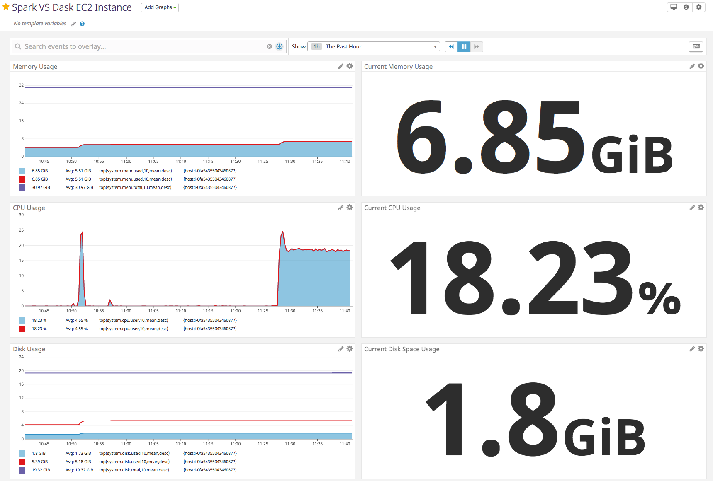

# Setup

- [Single EC2 Instance](#single-ec2-instance)
  * [Terraform Setup](#terraform-setup)
  * [Installing Dask](#installing-dask)
  * [Installing PySpark](#installing-pyspark)
    + [Download required files](#download-required-files)
    + [Install Java](#install-java)
    + [Unzip things](#unzip-things)
    + [Build conda environment](#build-conda-environment)
    + [Install pyspark](#install-pyspark)
    + [Grab the spark-avro jar](#grab-the-spark-avro-jar)
    + [Update .bashrc](#update-bashrc)
    + [Verifying things are working](#verifying-things-are-working)
      - [Pure Python](#pure-python)
      - [Pyspark](#pyspark)
  * [Datadog](#datadog)
- [Cluster Setup](#cluster-setup)


<sub>Made with [markdown TOC generator](https://ecotrust-canada.github.io/markdown-toc/).</sub>

## Single EC2 Instance

### Terraform Setup

Follow instructions [here](https://www.terraform.io/intro/getting-started/build.html).

```bash
terraform init
terraform plan
terraform apply
```

You can look at the `aws-terraform/*.tf` files to see my configuration. In particular, the `variables.tf` file below outlines the main parameters I selected.

```
#AWS
variable "aws_region"                 {default = "us-east-1"}

# Resource Tags
variable "ec2_name"                   {default = "pyspark_vs_dask"}

# Instance details
variable "key_name"                   { default = "default"}
variable "subnet_id"                  { default = "subnet-54f5a631" }
variable "iam_instance_profile"       { default = "EC2-S3-FULL-ACCESS" }
variable "security_groups"            { default = "sg-37b7ee48,sg-839e54f6" }
variable "instance_type"              { default = "r5.xlarge" }
variable "availability_zone"          { default = "us-east-1a" }
variable "ebs_delete_on_termination"  { default = true }
variable "root_block_device_vol_size" { default = 20 }

# bootstrap the ec2 instance
variable "ec2_user"                   { default = "ubuntu" }
variable "ec2_user_data"              { default = "user_data.sh" }
```

The R5 instances are described by AWS as being used for *fast performance for workloads that process large data sets in memory*. The `r5.xlarge` instance I chose has 4 vCPUs and 32 GB of RAM. 

For the instance's IAM role, I created new IAM role that has the default Amazon S3 full access policy attached. For security groups, I selected two default security groups that allow all inbound SSH traffic on port 22, and all inbound traffic on port 8888 (used for jupyter notebooks).

### Installing Dask

```bash
conda create -n dask python=3.6 -y -q
conda activate dask
conda install dask -y
conda install s3fs -c conda-forge -y # dependency for reading S3 files
```

### Installing PySpark

#### Download required files

```bash
wget https://www.apache.org/dist/spark/spark-2.3.1/spark-2.3.1-bin-without-hadoop.tgz

wget https://archive.apache.org/dist/hadoop/core/hadoop-2.9.1/hadoop-2.9.1.tar.gz
```

Download links reference:

- Spark: https://www.apache.org/dist/spark/spark-2.3.1/
- Hadoop: https://archive.apache.org/dist/hadoop/core/hadoop-2.9.1/

#### Install Java

```bash
sudo apt-get update
sudo apt-get install default-jre -y
```

And verify installation:

```bash
>>> java -version
openjdk version "1.8.0_181"
OpenJDK Runtime Environment (build 1.8.0_181-8u181-b13-0ubuntu0.16.04.1-b13)
OpenJDK 64-Bit Server VM (build 25.181-b13, mixed mode)
```

#### Unzip things

```bash
tar -xvzf hadoop-2.9.1.tar.gz && rm -f hadoop-2.9.1.tar.gz
tar -xvzf spark-2.3.1-bin-without-hadoop.tgz && rm -f spark-2.3.1-bin-without-hadoop.tgz
```

#### Build conda environment

```bash
conda create -n spark python=3.6 -y -q
conda activate spark
conda install -y conda=4.3.30
conda install -y pypandoc=1.4 py4j=0.10.7
conda install -y pandas # in order to convert spark dataframes back to pandas
```

#### Install pyspark

```bash
cd spark-2.3.1-bin-without-hadoop/python
python setup.py install
```

#### Grab the spark-avro jar


```bash
cd /home/ubuntu
wget http://repo1.maven.org/maven2/com/databricks/spark-avro_2.11/4.0.0/spark-avro_2.11-4.0.0.jar .
```

#### Update .bashrc


```bash
## JAVA_HOME
export JAVA_HOME=$(readlink -f /usr/bin/java | sed "s:bin/java::")
## add hadoop to path
export PATH=//home/ubuntu/hadoop-2.9.1/bin:$PATH
## add spark_to_path
export PATH=//home/ubuntu/spark-2.3.1-bin-without-hadoop/sbin://home/ubuntu/spark-2.3.1-bin-without-hadoop/bin:$PATH
## spark distribution classpath
export SPARK_DIST_CLASSPATH=$(hadoop classpath)://home/ubuntu/hadoop-2.9.1/share/hadoop/tools/lib/*://home/ubuntu/spark-avro_2.11-4.0.0.jar
## python fixing for conda environments
export PYTHONPATH=//home/ubuntu/spark-2.3.1-bin-without-hadoop/python/lib/py4j-0.10.7-src.zip:/opt/spark-2.3.1-bin-without-hadoop/python
```

#### Verifying things are working

##### Pure Python

```python
from pyspark import SparkConf, SparkContext, SQLContext
import datetime
import os

Sconf = SparkConf()
sc = SparkContext(appName="my_test", conf=Sconf)
## textfile = sc.textFile("s3a://<internal>/stuff.csv")
## sc.stop()

sqlContext = SQLContext(sparkContext=sc)

pa = '/home/ubuntu/data/0.avro'
df = sqlContext.read.format("com.databricks.spark.avro").load(pa)
print (df.count())
sc.stop()
```


##### Pyspark

```bash
(spark) ubuntu@ip-172-31-2-44:~$ pyspark
Python 3.7.0 (default, Jun 28 2018, 13:15:42)
[GCC 7.2.0] :: Anaconda, Inc. on linux
Type "help", "copyright", "credits" or "license" for more information.
2018-10-14 03:45:21 WARN  NativeCodeLoader:62 - Unable to load native-hadoop library for your platform... using builtin-java classes where applicable
Setting default log level to "WARN".
To adjust logging level use sc.setLogLevel(newLevel). For SparkR, use setLogLevel(newLevel).
Welcome to
      ____              __
     / __/__  ___ _____/ /__
    _\ \/ _ \/ _ `/ __/  '_/
   /__ / .__/\_,_/_/ /_/\_\   version 2.3.1
      /_/

Using Python version 3.7.0 (default, Jun 28 2018 13:15:42)
SparkSession available as 'spark'.

>>> pa = '/home/ubuntu/data/0.avro'
>>> df = spark.read.format("com.databricks.spark.avro").load(pa)
>>> df.count()
200

>>> pa = 's3a://dask-avro-data/0.avro'
>>> df = spark.read.format("com.databricks.spark.avro").load(pa)
```

### Datadog

Getting the datadog agent on your EC2 instance is quite straightforward. 

`DD_API_KEY=<api_key_from_datadog_site> bash -c "$(curl -L https://raw.githubusercontent.com/DataDog/datadog-agent/master/cmd/agent/install_script.sh)"`

```bash
  % Total    % Received % Xferd  Average Speed   Time    Time     Time  Current
                                 Dload  Upload   Total   Spent    Left  Speed
100 10446  100 10446    0     0  96525      0 --:--:-- --:--:-- --:--:-- 96722

* Installing apt-transport-https

...
...
...


* Adding your API key to the Agent configuration: /etc/datadog-agent/datadog.yaml

* Starting the Agent...


Your Agent is running and functioning properly. It will continue to run in the
background and submit metrics to Datadog.

If you ever want to stop the Agent, run:

    sudo systemctl stop datadog-agent

And to run it again run:

    sudo systemctl start datadog-agent
```

You can then go straight into the datadog site and start making dashboards. Here's a quick dashboard I made:



*Resources*
- https://www.datadoghq.com/blog/monitoring-ec2-instances-with-datadog/
- List of metrics: https://docs.datadoghq.com/integrations/system/


## Cluster Setup

Coming soon...